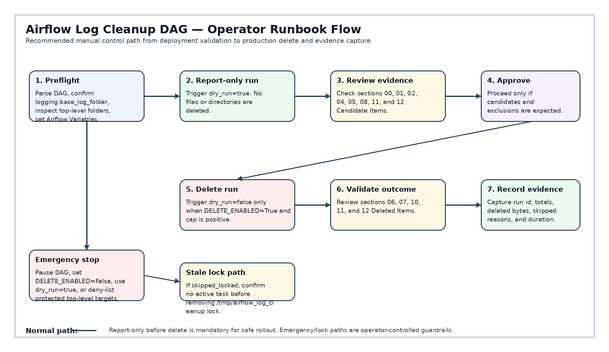
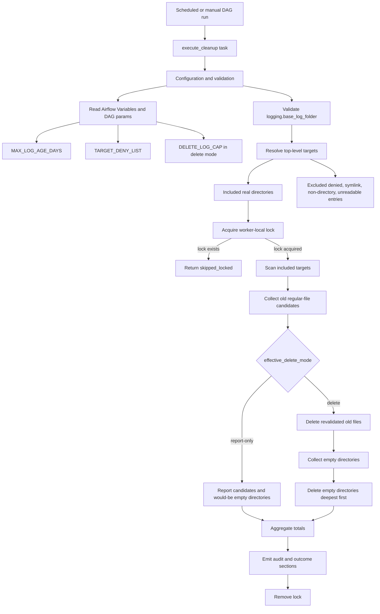

# Airflow Log Cleanup DAG


Production-oriented Apache Airflow maintenance DAG for cleaning old Airflow log files under the configured `logging.base_log_folder` only.

The DAG is intentionally conservative: it validates the configured log root, resolves cleanup scope only from real top-level directories, excludes protected targets through `TARGET_DENY_LIST`, selects only same-filesystem regular files older than `MAX_LOG_AGE_DAYS`, and removes empty directories only after file evaluation.

For operator procedures, use [`HOWTO.md`](HOWTO.md).

---

## High-level system view


---

## Operator runbook flow



---

## Table of contents

1. [Executive summary](#1-executive-summary)
2. [Runtime profile](#2-runtime-profile)
3. [Architecture](#3-architecture)
4. [Configuration model](#4-configuration-model)
5. [Target resolution](#5-target-resolution)
6. [Retention semantics](#6-retention-semantics)
7. [Execution modes](#7-execution-modes)
8. [Filesystem safety model](#8-filesystem-safety-model)
9. [Deletion behavior](#9-deletion-behavior)
10. [Audit and report output](#10-audit-and-report-output)
11. [Returned task result](#11-returned-task-result)
12. [Deployment quick start](#12-deployment-quick-start)
13. [Troubleshooting summary](#13-troubleshooting-summary)
14. [Quality posture](#14-quality-posture)
15. [Functional contract](#15-functional-contract)

---

## 1. Executive summary

At runtime the DAG:

- reads `logging.base_log_folder` from Airflow configuration
- validates the cleanup root before any scan is allowed
- reads `MAX_LOG_AGE_DAYS`, `TARGET_DENY_LIST`, and `DELETE_LOG_CAP` from Airflow Variables
- discovers direct children under the validated log root
- includes only real top-level directories not listed in `TARGET_DENY_LIST`
- excludes top-level symlinks, non-directories, unreadable entries, and denied targets
- walks included targets with `followlinks=False`
- keeps traversal constrained to the same filesystem device as each included target root
- selects only regular files with age strictly greater than `MAX_LOG_AGE_DAYS`
- revalidates file identity immediately before unlinking in delete mode
- collects empty directories after file evaluation
- removes empty directories deepest first in delete mode
- emits structured report blocks for configuration, evaluated state, advisories, scan summary, action outcome, skipped items, excluded items, and deleted/candidate items

The default DAG param is `dry_run=false`. Because the code constant `DELETE_ENABLED` is currently `True`, scheduled runs operate in delete mode unless a run is manually triggered with `dry_run=true` or the code constant is changed.

---

## 2. Runtime profile

| Area | Current value |
|---|---|
| DAG version | `2.10` |
| DAG ID | `airflow_log_cleanup` |
| Apache Airflow style | Airflow 3.0+ style DAG using `airflow.sdk` |
| Python | 3.11+ recommended |
| Schedule | `@daily` |
| Start date | `2024-01-01 Europe/Prague` |
| Catchup | `False` |
| Max active runs | `1` |
| Main task | `execute_cleanup` |
| Owner | `operations,maintenance` |
| Retries | `1` |
| Retry delay | `1 minute` |
| Task timeout | `5 minutes` |
| Runtime lock | `/tmp/airflow_log_cleanup.lock` |
| License posture | Apache-2.0 source header |

---

## 3. Architecture



### Processing layers

| Layer | Responsibility |
|---|---|
| Configuration | Read Airflow config, Airflow Variables, DAG params, and code constants. |
| Validation | Reject unsafe or overly broad cleanup roots. |
| Target resolution | Include only safe top-level real directories not denied by policy. |
| Scan engine | Traverse included targets without symlink following and without crossing filesystems. |
| Candidate selection | Select only old regular files where age is strictly above threshold. |
| Delete phase | Revalidate file identity, unlink files, collect empty directories, and remove empty directories. |
| Audit output | Emit deterministic operator-facing report blocks and grouped audit lists. |

---

## 4. Configuration model

### Airflow configuration

| Key | Required | Purpose |
|---|---:|---|
| `logging.base_log_folder` | Yes | Root directory under which cleanup targets are discovered. |

### Airflow Variables

| Variable | Default | Required | Purpose |
|---|---:|---:|---|
| `MAX_LOG_AGE_DAYS` | `30` | No | Strict positive integer retention threshold. Files are eligible only when age is strictly greater than this value. A value of `0` skips the task as unsafe. |
| `TARGET_DENY_LIST` | empty | No | Comma-separated top-level folder names under the validated log root to exclude from scanning and deletion. |
| `DELETE_LOG_CAP` | `10` | No | Strict positive integer used only in delete mode to cap rendered audit samples per reason group. Report-only mode is uncapped and displays this as `disabled`. |

### DAG params

| Param | Default | Purpose |
|---|---:|---|
| `dry_run` | `false` | When `true`, reports candidates and would-be empty directories without deleting anything. |

### Code constants

| Constant | Current value | Purpose |
|---|---:|---|
| `DELETE_ENABLED` | `True` | Global code-side switch. If `False`, all runs become report-only even when `dry_run=false`. |
| `LOCK_FILE_PATH` | `/tmp/airflow_log_cleanup.lock` | Worker-local lock file used to avoid same-host cleanup collisions. |
| `TASK_EXECUTION_TIMEOUT` | `5 minutes` | Maximum task runtime before Airflow marks the task as timed out. |

---

## 5. Target resolution

The DAG uses a deny-list-only scope model:

```text
included_targets = discovered_real_top_level_directories - TARGET_DENY_LIST
```

There is no allow-list in the current design.

### Included targets

A top-level entry under `logging.base_log_folder` is included only when all conditions are true:

- metadata is readable
- entry is a real directory
- entry is not a symlink
- entry name is not present in `TARGET_DENY_LIST`

### Excluded targets

A top-level entry is excluded and reported when any condition is true:

- metadata is unreadable
- entry is a symlink
- entry is a regular file or other non-directory entry
- entry name is in `TARGET_DENY_LIST`

### Valid deny-list names

`TARGET_DENY_LIST` entries must be safe top-level names only.

Accepted examples:

```text
scheduler
triggerer
dag_processor
```

Rejected examples:

```text
../scheduler
scheduler/subdir
/scheduler
.
..
```

Invalid names are ignored and surfaced as `TARGET_DENY_LIST_INVALID` and as configuration advisory records.

---

## 6. Retention semantics

The retention rule is strict:

```text
candidate only when file_age_seconds > MAX_LOG_AGE_DAYS * 86400
```

| File age | Threshold | Outcome |
|---:|---:|---|
| `29.9 days` | `30 days` | retained |
| `30.0 days` | `30 days` | retained |
| `30.1 days` | `30 days` | candidate |

A file can become a candidate only when it is:

- inside an included target
- on the same filesystem device as that included target root
- metadata-readable
- a regular file
- older than the strict retention threshold

Files that are not above the threshold are kept and reported in excluded audit records with age and threshold detail.

---

## 7. Execution modes

Effective mode calculation:

```text
effective_delete_mode = "report-only" if dry_run or not DELETE_ENABLED else "delete"
```

| `dry_run` | `DELETE_ENABLED` | Effective mode | File deletion | Directory deletion |
|---:|---:|---|---:|---:|
| `true` | `true` | `report-only` | No | No |
| `true` | `false` | `report-only` | No | No |
| `false` | `false` | `report-only` | No | No |
| `false` | `true` | `delete` | Yes | Yes |

### Default scheduled behavior

The DAG parameter default is:

```python
params={"dry_run": False}
```

With the current code-side value:

```python
DELETE_ENABLED = True
```

Scheduled runs therefore delete eligible files and empty directories by default.

---

## 8. Filesystem safety model

### Root validation

The cleanup root must be:

- configured through `logging.base_log_folder`
- non-empty
- absolute
- not an explicitly blocked broad root
- specific enough by path depth

Blocked broad roots include:

```text
/
/bin
/boot
/dev
/etc
/home
/lib
/lib64
/opt
/opt/airflow
/proc
/root
/run
/sbin
/srv
/sys
/tmp
/usr
/var
/var/log
```

### Traversal controls

The scan engine:

- uses `os.walk(..., followlinks=False)`
- uses `stat(..., follow_symlinks=False)` for metadata checks
- rejects top-level symlinks during target resolution
- does not descend into symlink directories
- does not cross filesystem device boundaries from each included target root
- audits unreadable directories instead of treating them as removable

---

## 9. Deletion behavior

Delete mode uses a two-phase file flow:

1. scan and collect old regular-file candidates
2. revalidate each candidate immediately before unlinking

A file candidate is deleted only if its current filesystem identity still matches scan-time identity:

- device
- inode
- modification time in nanoseconds
- size
- regular-file type

If the file disappeared, became unreadable, changed inode, changed size, changed modification time, or stopped being a regular file, it is skipped and audited. The DAG does not crash for these race conditions.

Directory cleanup happens after file evaluation:

- delete mode deletes eligible files first, then removes directories that are actually empty
- report-only mode treats old-file candidates as logically absent so would-be empty directories are visible
- directory candidates are removed deepest first and revalidated before `rmdir()`

---

## 10. Audit and report output

The DAG output is structured into numbered sections.

| Section | Title | Purpose |
|---:|---|---|
| `00` | `Execution Context` | Shows active threshold, cap display, dry-run flag, delete switch, effective mode, lock path, and evaluation epoch. |
| `01` | `Configurable switches` | Shows configuration inputs, source type, current value, and purpose. |
| `02` | `Evaluated State` | Shows parsed and evaluated runtime state, including valid and invalid deny-list names. |
| `03` | `Configuration Failure` | Emitted only on invalid configuration before task exit. |
| `04` | `Deletion Scope and Exclusions` | Explains scan scope, deny-list behavior, file eligibility, safety skips, and effective mode. |
| `05` | `Root Scan Summary` | Aggregated scan counters with `Decision` and `EvaluationMethod` for non-zero skip counters. |
| `06` | `Action Outcome Summary` | Effective mode, deleted file count, deleted byte total, deleted directory count, and delete-time skipped items. |
| `07` | `Overall Outcome` | Final task status and full aggregate counters. |
| `08` | `Configuration Advisories` | Emitted only when invalid deny-list entries or no included targets need operator attention. |
| `10` | `Action Skipped Items` | Delete-time skips, grouped by reason. |
| `11` | `Excluded Items` | Excluded targets and scan/evaluation skips, grouped by reason. |
| `12` | `Deleted Items` or `Candidate Items` | Deleted items in delete mode; would-delete candidates in report-only mode. |
| `99` | `Lock Cleanup Warning` | Emitted only when lock-file removal fails. |

### Audit item behavior

Audit output is deterministic:

- records are grouped by stable reason text
- rendered records are deduplicated within each reason group
- total counters remain exact even when delete-mode output is capped
- report-only mode renders uncapped audit samples
- deleted/candidate file groups are shown before deleted/candidate directory groups
- directory records are sorted deepest first where directory ordering matters

---

## 11. Returned task result

The task returns a dictionary suitable for XCom inspection.

Successful completed result shape:

```json
{
  "status": "completed",
  "roots_processed": 0,
  "directories_visited": 0,
  "directory_entries_seen": 0,
  "file_entries_seen": 0,
  "files_scanned_regular": 0,
  "regular_file_total_size_bytes": 0,
  "candidate_file_total_size_bytes": 0,
  "old_file_candidates": 0,
  "empty_dir_candidates": 0,
  "files_deleted": 0,
  "files_deleted_bytes": 0,
  "empty_dirs_deleted": 0,
  "duration_seconds": 0.0,
  "action_skipped_items": 0
}
```

Lock-skipped result shape:

```json
{
  "status": "skipped_locked",
  "roots_processed": 0,
  "directories_visited": 0,
  "directory_entries_seen": 0,
  "file_entries_seen": 0,
  "files_scanned_regular": 0,
  "regular_file_total_size_bytes": 0,
  "candidate_file_total_size_bytes": 0,
  "old_file_candidates": 0,
  "empty_dir_candidates": 0,
  "files_deleted": 0,
  "files_deleted_bytes": 0,
  "empty_dirs_deleted": 0,
  "duration_seconds": 0.0
}
```

---

## 12. Deployment quick start

### 1. Place the DAG file

```bash
cp log_clean_maint.py "$AIRFLOW_HOME/dags/log_clean_maint.py"
```

### 2. Confirm Airflow parses the DAG

```bash
airflow dags list | grep airflow_log_cleanup
```

### 3. Confirm Airflow logging root

```bash
airflow config get-value logging base_log_folder
```

The value must be absolute and must not be one of the blocked broad roots.

### 4. Configure Airflow Variables

```bash
airflow variables set MAX_LOG_AGE_DAYS 30
airflow variables set TARGET_DENY_LIST 'scheduler,triggerer,dag_processor'
airflow variables set DELETE_LOG_CAP 25
```

### 5. Start with manual report-only validation

```bash
airflow dags trigger airflow_log_cleanup --conf '{"dry_run": true}'
```

### 6. Review report sections

Review:

- `00 :: Execution Context`
- `01 :: Configurable switches`
- `02 :: Evaluated State`
- `04 :: Deletion Scope and Exclusions`
- `05 :: Root Scan Summary`
- `08 :: Configuration Advisories`, if emitted
- `11 :: Excluded Items`
- `12 :: Candidate Items`

### 7. Run delete mode intentionally

```bash
airflow dags trigger airflow_log_cleanup --conf '{"dry_run": false}'
```

Use scheduled delete mode only after dry-run output has been reviewed.

---

## 13. Troubleshooting summary

| Symptom | Likely cause | First action |
|---|---|---|
| Task returns `skipped_locked` | Worker-local lock file already exists | Verify no cleanup run is active, then inspect `/tmp/airflow_log_cleanup.lock`. |
| Configuration failure | Invalid root, invalid integer, or target-resolution problem | Read `03 :: Configuration Failure`. |
| Expected target not scanned | Deny-listed, symlink, non-directory, unreadable | Read `02 :: Evaluated State` and `11 :: Excluded Items`. |
| Expected file not deleted | Not old enough, non-regular, cross-device, changed before delete | Read `05 :: Root Scan Summary`, `10 :: Action Skipped Items`, and `11 :: Excluded Items`. |
| Empty directory not deleted | Directory still has blocking content or changed before `rmdir()` | Read `10 :: Action Skipped Items` and `11 :: Excluded Items`. |
| Logs too large in delete mode | `DELETE_LOG_CAP` too high | Lower `DELETE_LOG_CAP`. Report-only mode remains uncapped by design. |

Full operational procedures are in [`HOWTO.md`](HOWTO.md).

---

## 14. Quality posture

The DAG is designed around:

- explicit configuration validation
- conservative filesystem behavior
- no shell command execution
- deterministic audit grouping
- type-oriented Python structure
- Airflow task-log readability
- safe handling of common filesystem races
- Apache-2.0-compatible source distribution

Recommended validation before production promotion:

```bash
python -m py_compile log_clean_maint.py
ruff check log_clean_maint.py
ruff format --check log_clean_maint.py
mypy log_clean_maint.py
```

---

## 15. Functional contract

### The DAG guarantees

- cleanup stays under validated `logging.base_log_folder`
- broad roots are rejected
- top-level symlinks are not traversed
- traversal does not follow symlink directories
- traversal does not cross filesystem device boundaries from an included target root
- only regular files older than the strict threshold can be deleted
- file and directory identity is revalidated before destructive operations
- delete uncertainty becomes skip/audit, not blind deletion
- exact counters are preserved even when delete-mode audit rendering is capped

### The DAG does not guarantee

- stale-lock auto-recovery
- rollback after partial deletion
- archival before delete
- compression before delete
- metadata database cleanup
- object-storage lifecycle management
- recursive deny-list rules below included top-level targets
- cleanup outside `logging.base_log_folder`

---

## Change summary

This README was synchronized with `log_clean_maint.py` DAG version `2.10`.

### Added

- corrected high-level system visual
- accurate configuration and execution-mode contract
- delete-mode-only `DELETE_LOG_CAP` documentation
- actual DAG ID and version
- accurate numbered report-section map
- HOWTO/runbook entry point

### Corrected

- removed stale allow-list language
- replaced `LOGGING__BASE_LOG_FOLDER` wording with `logging.base_log_folder`
- changed `Target Resolution` section numbering to match actual emitted sections
- clarified report-only mode includes both `dry_run=true` and `DELETE_ENABLED=False`
- corrected scheduled behavior and XCom result shape

### Kept intact

- Apache-2.0 licensing posture
- deny-list-only cleanup policy
- strict retention behavior
- dry-run/report-only and delete-mode operational model
- filesystem safety emphasis
- audit/reporting focus
