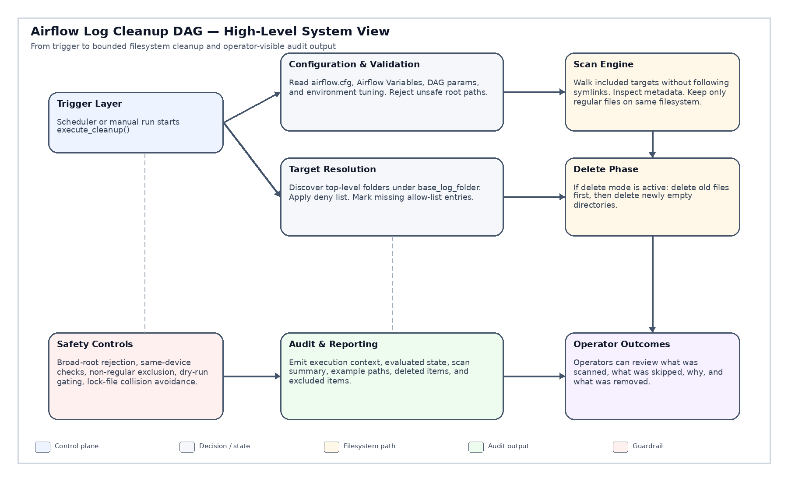
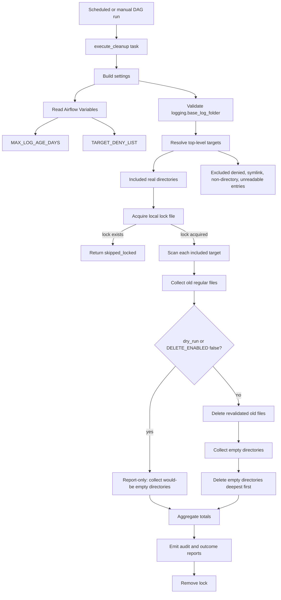

# Airflow Log Cleanup DAG


Production-oriented Apache Airflow maintenance DAG for cleaning old Airflow log files under the configured `logging.base_log_folder` only.

The DAG is intentionally conservative. It validates the log root, resolves cleanup scope from real top-level directories, excludes protected top-level targets through `TARGET_DENY_LIST`, selects only same-filesystem regular files older than `MAX_LOG_AGE_DAYS`, and removes empty directories only after file evaluation.

---

## Table of contents

1. [Executive summary](#1-executive-summary)
2. [Compatibility and runtime profile](#2-compatibility-and-runtime-profile)
3. [Architecture](#3-architecture)
4. [Functional scope](#4-functional-scope)
5. [Configuration model](#5-configuration-model)
6. [Target resolution](#6-target-resolution)
7. [Retention semantics](#7-retention-semantics)
8. [Execution modes](#8-execution-modes)
9. [Filesystem safety model](#9-filesystem-safety-model)
10. [Deletion behavior](#10-deletion-behavior)
11. [Directory cleanup behavior](#11-directory-cleanup-behavior)
12. [Audit and report output](#12-audit-and-report-output)
13. [Returned task result](#13-returned-task-result)
14. [Deployment](#14-deployment)
15. [Operational runbook](#15-operational-runbook)
16. [Troubleshooting](#16-troubleshooting)
17. [Quality posture](#17-quality-posture)
18. [Functional contract](#18-functional-contract)
19. [Repository labels](#19-repository-labels)
20. [Change summary](#20-change-summary)

---

## 1. Executive summary

At runtime the DAG:

- reads `logging.base_log_folder` from Airflow configuration
- validates the cleanup root before any scan is allowed
- reads `MAX_LOG_AGE_DAYS` from Airflow Variables, defaulting to `30`
- reads `TARGET_DENY_LIST` from Airflow Variables, defaulting to an empty list
- discovers direct children under the validated log root
- includes only real top-level directories not denied by `TARGET_DENY_LIST`
- excludes top-level symlinks, non-directories, unreadable entries, and denied targets
- walks included targets with `followlinks=False`
- keeps traversal constrained to the same filesystem device as each included target root
- selects only regular files with age strictly greater than `MAX_LOG_AGE_DAYS`
- revalidates file identity before unlinking in delete mode
- collects empty directories after file evaluation
- removes empty directories deepest first in delete mode
- emits structured report blocks for configuration, evaluated state, target resolution, scan summary, action outcome, final outcome, deleted items, and excluded items

The default DAG param is `dry_run=false`. Because the code constant `DELETE_ENABLED` is currently `True`, scheduled runs operate in delete mode unless the run is manually triggered with `dry_run=true` or the code constant is changed.

---

## 2. Compatibility and runtime profile

High-level system view




| Area | Value |
|---|---|
| DAG version | `2.0` |
| Apache Airflow | `3.0+` style DAG using `airflow.sdk` |
| Python | `3.11+` recommended |
| DAG ID | Derived from file name through `Path(__file__).stem` |
| Schedule | `@daily` |
| Start date | `2024-01-01 Europe/Prague` |
| Catchup | `False` |
| Max active runs | `1` |
| Main task | `execute_cleanup` |
| Owner | `operations` |
| Retries | `1` |
| Retry delay | `1 minute` |
| Failure email flag | Enabled through `email_on_failure=True`; recipient list is empty until configured in code |
| Runtime lock | `/tmp/airflow_log_cleanup.lock` |
| License posture | Apache-2.0 source header and repository usage |

---

## 3. Architecture



### Processing layers

| Layer | Responsibility |
|---|---|
| Configuration | Read Airflow config, Airflow Variables, DAG params, and code constants. |
| Validation | Reject unsafe or overly broad cleanup roots. |
| Target resolution | Include only safe top-level real directories not denied by policy. |
| Scan engine | Traverse included targets without symlink following and without crossing filesystems. |
| Candidate selection | Select only old regular files where age is strictly above threshold. |
| Delete phase | Revalidate file identity, unlink files, collect empty directories, remove empty directories. |
| Audit output | Emit deterministic operator-facing report blocks and grouped audit lists. |

---

## 4. Functional scope

### In scope

- Airflow log filesystem cleanup under `logging.base_log_folder`
- deny-list based top-level target exclusion
- regular-file retention by modification age
- same-device traversal enforcement per included target root
- symlink-safe top-level target resolution
- symlink-safe directory traversal
- dry-run / report-only mode
- delete mode with scan-time identity revalidation
- empty-directory cleanup after file evaluation
- local lock-file based collision avoidance
- structured scan, action, outcome, deleted-item, and excluded-item reporting

### Out of scope

- Airflow metadata database cleanup
- object-storage lifecycle management
- log compression
- log archival
- content-aware retention
- retention based on DAG ID, task ID, or run ID semantics
- cleanup outside `logging.base_log_folder`
- recursive allow-list policy
- stale-lock auto-recovery
- transactional rollback of partial delete runs

---

## 5. Configuration model

### Airflow configuration

| Key | Required | Purpose |
|---|---:|---|
| `logging.base_log_folder` | Yes | Root directory under which cleanup targets are discovered. |

### Airflow Variables

| Variable | Default | Required | Purpose |
|---|---:|---:|---|
| `MAX_LOG_AGE_DAYS` | `30` | No | Non-negative integer retention threshold. Files are eligible only when age is strictly greater than this value. |
| `TARGET_DENY_LIST` | empty | No | Comma-separated top-level folder names under the validated log root to exclude from scanning and deletion. |

### DAG params

| Param | Default | Purpose |
|---|---:|---|
| `dry_run` | `false` | When `true`, reports candidates and would-be empty directories without deleting anything. |

### Code constants

| Constant | Current value | Purpose |
|---|---:|---|
| `DELETE_ENABLED` | `True` | Global code-side switch. If `False`, all runs become report-only even when `dry_run=false`. |
| `LOCK_FILE_PATH` | `/tmp/airflow_log_cleanup.lock` | Local lock file used to avoid concurrent cleanup collisions on the worker filesystem. |
| `DAG_VERSION` | `2.0` | Version tag exposed in DAG tags. |

### Valid example

```text
MAX_LOG_AGE_DAYS = 30
TARGET_DENY_LIST = scheduler,triggerer,dag_processor
```

### Manual dry run

```json
{
  "dry_run": true
}
```

### Manual delete run

```json
{
  "dry_run": false
}
```

---

## 6. Target resolution

The DAG uses a deny-list-only scope model.

```text
included_targets = discovered_real_top_level_directories - TARGET_DENY_LIST
```

There is no `TARGET_ALLOW_LIST` in the current code.

### Included targets

A top-level entry under `logging.base_log_folder` is included only when all conditions are true:

- the entry metadata is readable
- the entry is a real directory
- the entry is not a symlink
- the entry name is not present in `TARGET_DENY_LIST`

### Excluded targets

A top-level entry is excluded and reported when any condition is true:

- metadata is unreadable
- entry is a symlink
- entry is not a real directory
- entry name is in `TARGET_DENY_LIST`

### Valid deny-list names

`TARGET_DENY_LIST` entries must be safe top-level names only.

Accepted examples:

```text
scheduler
triggerer
dag_processor
```

Rejected examples:

```text
../scheduler
scheduler/subdir
/scheduler
.
..
```

Invalid names are ignored and surfaced in evaluated state as `TARGET_DENY_LIST_INVALID`.

---

## 7. Retention semantics

The retention rule is strict.

```text
delete candidate only when file_age_seconds > MAX_LOG_AGE_DAYS * 86400
```

Resulting behavior:

| File age | Threshold | Outcome |
|---:|---:|---|
| `29.9 days` | `30 days` | retained |
| `30.0 days` | `30 days` | retained |
| `30.1 days` | `30 days` | candidate |

A file can become a candidate only when it is:

- inside an included target
- on the same filesystem device as that included target root
- metadata-readable
- a regular file
- older than the strict retention threshold

Files not above the threshold are not deleted. They are reported in excluded audit records with age and threshold detail.

---

## 8. Execution modes

### Effective mode calculation

```text
effective_delete_mode = "report-only" if dry_run or not DELETE_ENABLED else "delete"
```

| `dry_run` | `DELETE_ENABLED` | Effective mode | File deletion | Directory deletion |
|---:|---:|---|---:|---:|
| `true` | `true` | `report-only` | No | No |
| `true` | `false` | `report-only` | No | No |
| `false` | `false` | `report-only` | No | No |
| `false` | `true` | `delete` | Yes | Yes |

### Default scheduled behavior

The DAG param default is:

```python
params={"dry_run": False}
```

With the current code-side value:

```python
DELETE_ENABLED = True
```

Scheduled runs therefore delete eligible files and empty directories by default.

---

## 9. Filesystem safety model

### Root validation

The cleanup root must be:

- configured through `logging.base_log_folder`
- non-empty
- absolute
- not an explicitly blocked broad root
- specific enough by path depth

Blocked broad roots:

```text
/
/bin
/boot
/dev
/etc
/home
/lib
/lib64
/opt
/opt/airflow
/proc
/root
/run
/sbin
/srv
/sys
/tmp
/usr
/var
/var/log
```

### Traversal controls

The scan engine:

- uses `os.walk(..., followlinks=False)`
- uses `stat(..., follow_symlinks=False)` for filesystem metadata checks
- rejects top-level symlinks during target resolution
- does not descend into symlink directories
- does not cross filesystem device boundaries from each included target root
- audits unreadable directories instead of treating them as removable

### File type controls

Only regular files can become delete candidates.

Skipped and audited classes include:

- unreadable files
- cross-device files
- non-regular entries
- unreadable directories
- non-directory traversal entries
- cross-device directories

---

## 10. Deletion behavior

Delete mode uses a two-phase file flow:

1. scan and collect old regular file candidates
2. revalidate each candidate immediately before unlinking

A file candidate is deleted only if its current filesystem identity still matches scan-time identity:

- device
- inode
- modification time
- size
- regular-file type

If the file disappeared, became unreadable, changed inode, changed size, changed modification time, or stopped being a regular file, it is skipped. The DAG does not crash for these race conditions; uncertain files are preserved.

### File deletion order

File candidates are sorted by path length and then path. This gives stable candidate processing and report output.

---

## 11. Directory cleanup behavior

Directory cleanup happens after file evaluation.

### Delete mode

In delete mode the DAG:

1. deletes eligible files first
2. collects directories that are actually empty after file deletion
3. removes empty directories deepest first

### Dry-run mode

In dry-run mode the DAG does not delete files. For parity with delete mode, old file candidates are treated as logically absent when collecting would-be empty directories. This lets the report show directories that would become empty after deleting candidate files.

### Directory removability rule

A directory is removable only when its evaluated subtree has no blocking entries.

Blocking entries include:

- remaining regular files
- non-directory entries
- unreadable child entries
- cross-device child directories
- child subtrees that could not be evaluated safely

An included top-level target root may also be removed if it becomes empty and is not deny-listed.

---

## 12. Audit and report output

The DAG output is structured into numbered sections.

| Section | Title | Purpose |
|---:|---|---|
| `00` | `Execution Context` | Shows active threshold, dry-run flag, delete switch, effective mode, and lock path. |
| `01` | `Configurable switches` | Shows configuration inputs, source type, current value, and purpose. |
| `02` | `Evaluated State` | Shows parsed and evaluated runtime state, including valid and invalid deny-list names. |
| `03` | `Target Resolution` | Shows included and excluded top-level targets with paths and reasons. |
| `04` | `Deletion Scope and Exclusions` | Explains scan scope, deny-list behavior, file eligibility, safety skips, and execution mode. |
| `05` | `Root Scan Summary` | Aggregated scan counters with `Decision` and `EvaluationMethod` for skip counters. |
| `06` | `Action Outcome Summary` | Effective mode, deleted file count, deleted byte total, and deleted directory count. |
| `07` | `Overall Outcome` | Final task status and full aggregate counters. |
| `10` | `Deleted Items` | Grouped list of deleted files and deleted empty directories. |
| `11` | `Excluded Items` | Grouped list of excluded targets and skipped entries. |
| `99` | `Lock Cleanup Warning` | Warning emitted only when lock-file removal fails. |

### Root Scan Summary metrics

| Metric | Meaning |
|---|---|
| `roots_processed` | Count of included top-level targets processed. |
| `directories_visited` | Directories visited by scan traversal. |
| `directory_entries_seen` | Directory entries seen during scan. |
| `file_entries_seen` | File entries seen during scan. |
| `files_scanned_regular` | Regular files evaluated for age threshold. |
| `regular_file_total_size` | Total size of scanned regular files. |
| `old_file_candidates` | Regular files older than threshold. |
| `old_file_candidate_total_size` | Total size of old file candidates. |
| `empty_dir_candidates` | Directories empty or expected to become empty after candidate deletion. |
| `directories_skipped_inaccessible` | Directories skipped because metadata was unreadable. |
| `directories_skipped_not_directory` | Traversal entries skipped because they were not directories. |
| `directories_skipped_mount_boundary` | Directories skipped because they were on another filesystem. |
| `files_skipped_inaccessible` | Files skipped because metadata was unreadable. |
| `files_skipped_cross_device` | Files skipped because they were on another filesystem. |
| `files_skipped_non_regular` | Entries skipped because they were not regular files. |

Skip metrics show `Decision=skipped` and an explanatory `EvaluationMethod` only when the metric value is greater than zero.

### Audit item ordering

Audit output is deterministic:

- records are deduplicated
- records are grouped by stable reason text
- deleted file groups are shown before deleted directory groups
- age-threshold file records are sorted by age detail where available
- deleted empty directories are sorted deepest first
- blank lines are inserted between audit reason groups

---

## 13. Returned task result

The task returns a dictionary suitable for XCom inspection.

### Successful completed result

```json
{
  "status": "completed",
  "roots_processed": 0,
  "directories_visited": 0,
  "directory_entries_seen": 0,
  "file_entries_seen": 0,
  "files_scanned_regular": 0,
  "regular_file_total_size_bytes": 0,
  "candidate_file_total_size_bytes": 0,
  "old_file_candidates": 0,
  "empty_dir_candidates": 0,
  "files_deleted": 0,
  "files_deleted_bytes": 0,
  "empty_dirs_deleted": 0,
  "duration_seconds": 0.0
}
```

### Lock-skipped result

If the lock file already exists, the task returns:

```json
{
  "status": "skipped_locked",
  "roots_processed": 0,
  "directories_visited": 0,
  "directory_entries_seen": 0,
  "file_entries_seen": 0,
  "files_scanned_regular": 0,
  "regular_file_total_size_bytes": 0,
  "candidate_file_total_size_bytes": 0,
  "old_file_candidates": 0,
  "empty_dir_candidates": 0,
  "files_deleted": 0,
  "files_deleted_bytes": 0,
  "empty_dirs_deleted": 0,
  "duration_seconds": 0.0
}
```

The lock-skipped path emits `Overall Outcome`, `Deleted Items`, and `Excluded Items` only.

---

## 14. Deployment

### 1. Place DAG file

Copy the DAG file to the Airflow DAGs folder, for example:

```bash
cp log_clean.py "$AIRFLOW_HOME/dags/log_clean.py"
```

### 2. Confirm Airflow logging root

Check the value of `logging.base_log_folder`:

```bash
airflow config get-value logging base_log_folder
```

The value must be an absolute path and must not be one of the blocked broad roots.

### 3. Configure Airflow Variables

Example:

```bash
airflow variables set MAX_LOG_AGE_DAYS 30
airflow variables set TARGET_DENY_LIST 'scheduler,triggerer,dag_processor'
```

### 4. Start with a manual dry run

```bash
airflow dags trigger log_clean --conf '{"dry_run": true}'
```

### 5. Review the report

Review especially:

- `03 :: Target Resolution`
- `04 :: Deletion Scope and Exclusions`
- `05 :: Root Scan Summary`
- `10 :: Deleted Items`
- `11 :: Excluded Items`

### 6. Enable production behavior intentionally

The current code already has:

```python
DELETE_ENABLED = True
params={"dry_run": False}
```

Therefore, after deployment, scheduled runs delete candidates unless you change the code constant or manually trigger with `dry_run=true`.

---

## 15. Operational runbook

### First rollout checklist

1. Deploy the DAG.
2. Verify `logging.base_log_folder` is specific and correct.
3. Set `MAX_LOG_AGE_DAYS`.
4. Set `TARGET_DENY_LIST` for protected top-level folders.
5. Trigger a manual dry run.
6. Validate included and excluded targets.
7. Validate old-file candidate counts.
8. Validate would-be empty-directory candidate counts.
9. Validate skipped items and reasons.
10. Allow scheduled delete behavior only after audit review.

### Normal run review

For each production run, inspect:

- effective mode
- roots processed
- target resolution
- old file candidates
- deleted files
- deleted bytes
- empty directory candidates
- deleted empty directories
- skipped inaccessible entries
- skipped cross-device entries
- skipped non-regular entries
- total duration

### Emergency stop

Use one of these options:

- trigger only with `dry_run=true`
- change `DELETE_ENABLED = False` and redeploy
- pause the DAG in Airflow UI
- set `TARGET_DENY_LIST` to include all discovered top-level targets that must be protected

---

## 16. Troubleshooting

### The task returns `skipped_locked`

Cause: `/tmp/airflow_log_cleanup.lock` already exists on the worker where the task ran.

Action:

1. Verify no cleanup task is currently running.
2. Check whether a previous task was killed before lock cleanup.
3. Remove the lock file manually only after validating that no active cleanup process owns it.

### Root validation fails

Cause: `logging.base_log_folder` is missing, relative, too shallow, or an explicitly blocked broad root.

Action:

- set `logging.base_log_folder` to a specific Airflow log directory
- do not point cleanup at broad system directories such as `/tmp`, `/var`, `/var/log`, `/opt`, or `/opt/airflow`

### Expected target is not scanned

Possible causes:

- it is listed in `TARGET_DENY_LIST`
- it is not a real directory
- it is a symlink
- its metadata is unreadable

Action: inspect `03 :: Target Resolution` and `11 :: Excluded Items`.

### Expected file is not deleted

Possible causes:

- `dry_run=true`
- `DELETE_ENABLED=False`
- file age is not strictly greater than threshold
- file is not regular
- file is on another filesystem
- file metadata is unreadable
- file changed between scan and delete revalidation

Action: inspect `04 :: Deletion Scope and Exclusions`, `05 :: Root Scan Summary`, and `11 :: Excluded Items`.

### Empty directory is not deleted

Possible causes:

- directory still contains a blocking entry
- directory subtree contains unreadable content
- directory is on another filesystem
- directory is not a real directory
- directory became non-empty before deletion

Action: inspect `empty_dir_candidates`, `empty_dirs_deleted`, and excluded directory reasons.

---

## 17. Quality posture

The codebase is structured for reviewable, typed, low-shell-risk operations:

- Apache-2.0 source header
- explicit type annotations
- dataclasses for settings, scan stats, totals, records, candidates, and results
- no shell-based deletion commands
- `pathlib`, `os`, and `stat` based filesystem handling
- symlink-conscious metadata checks
- bounded root validation
- local lock file with restrictive mode `0o600`
- deterministic table rendering
- deterministic audit grouping and sorting
- mypy-oriented data model
- Ruff-compatible style expectations

Recommended local checks:

```bash
ruff format --check log_clean.py
ruff check log_clean.py
mypy --python-version 3.11 log_clean.py
python -m py_compile log_clean.py
```

---

## 18. Functional contract

### The DAG guarantees by design

- It does not intentionally clean outside the validated `logging.base_log_folder` scope.
- It rejects known broad cleanup roots.
- It includes only real top-level directories not listed in `TARGET_DENY_LIST`.
- It excludes top-level symlinks from traversal.
- It does not follow symlink directories during traversal.
- It does not cross filesystem device boundaries from an included target root.
- It deletes only regular files older than the strict threshold.
- It revalidates file identity before deletion.
- It removes directories only after file evaluation.
- It logs excluded and deleted items in grouped audit output.
- It exposes final counters through the returned task result.

### The DAG intentionally does not guarantee

- recovery from stale lock files
- rollback after partial deletion
- content-based retention
- archive-before-delete behavior
- object-storage cleanup
- metadata database cleanup
- allow-list-only operation
- recursive deny-list behavior below included targets

---


---

## 20. Change summary

This README is synchronized with the uploaded `log_clean.py` DAG version `2.0`.

### Added

- complete A-Z operational documentation
- architecture diagram using Mermaid
- exact configuration tables
- deny-list-only target resolution contract
- strict retention rule examples
- effective execution mode matrix
- root validation and blocked-root documentation
- file identity revalidation explanation
- dry-run versus delete-mode directory cleanup behavior
- numbered report-section reference
- returned task result schema
- deployment and operational runbook
- troubleshooting section
- functional guarantees and non-guarantees
- repository labels and badge metadata

### Removed

- stale environment tuning variables not present in the current DAG
- stale progress-report claims not present in the current DAG
- stale example-path reporting claims not present in the current DAG
- stale Airflow 3.1-only compatibility wording where the DAG source declares Airflow 3.0+ compatibility
- stale references to older internal citation markers

### Kept intact

- Apache-2.0 licensing posture
- deny-list-only cleanup policy
- strict regular-file age retention behavior
- dry-run and delete-mode operational model
- filesystem safety emphasis
- audit/reporting focus
- Ruff and mypy-oriented quality posture
